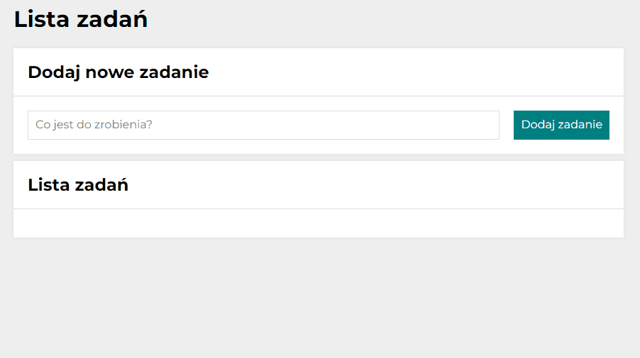

# **TO DO LIST**

## Description
A handy list used to save scheduled tasks. Allows you to add, delete and mark tasks as completed.

## Contents
- Tasks list with input field
- Buttons for managing the tasks

## Technologies
- HTML
- CSS
- JS ES6+
- BEM convention

## Features
- Visual styling
- Sample Grid/Flexbox layouts
- Media queries

## Demo
https://krzysztof-gronski.github.io/todolist

## Preview

